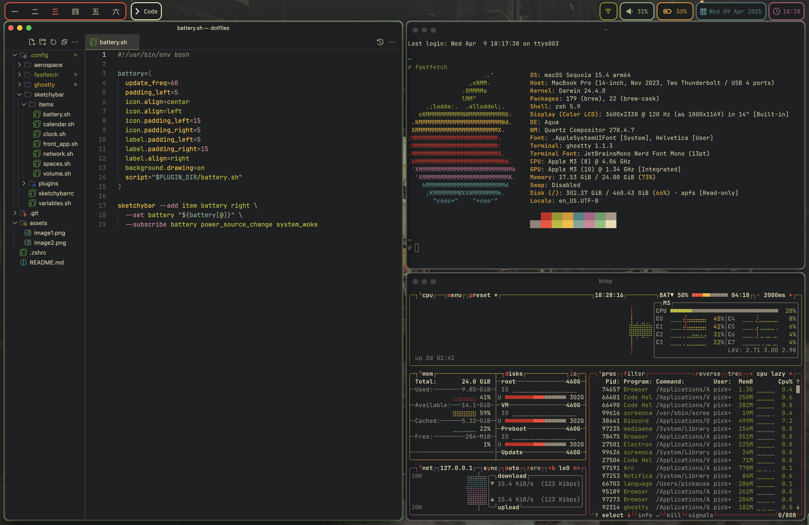

# dotfiles

----------------------
My dotfiles configuration on MacOS

## Screenshot

----------------------

## Stuff I have used

----------------------

* Bar: [SketchyBar](https://github.com/FelixKratz/SketchyBar)
* Border: [JankyBorders](https://github.com/FelixKratz/JankyBorders)
* WM: [AeroSpace](https://github.com/nikitabobko/AeroSpace)
* Theme: [GruvBox](https://github.com/morhetz/gruvbox)
* Wallpaper: [Wallpaper](https://gruvbox-wallpapers.pages.dev/wallpapers/anime/wallhaven-2e2xyx.jpg)
